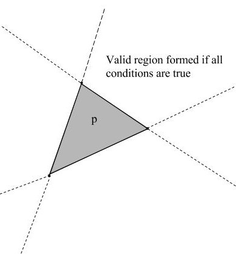

# CSC418 Computer Graphics Assignment 1
Michael Vu
1002473272
## 1. Curves

### 1.1 Convert Parametric to Implicit

$$
\begin{align}
x(t)^2&=4\sin^2(t)\\
y(t)^2&=25\sin ^2(t)\cos^2(t)\\
y(t)^2&=\frac{25}{16}x^2(4-x^2)\\
0&=y^2+\frac{25}{16}x^4-\frac{25}{4}x^2
\end{align}
$$

### 1.2 Tangent Vector

$$
\begin{align}
\vec{T}(t)&=\frac{\langle\frac{dx}{dt},\frac{dy}{dt}\rangle}{||\langle\frac{dx}{dt},\frac{dy}{dt}\rangle||}\\
\frac{dx}{dt}&=2\cos(t)\\
\frac{dy}{dt}&=5\cos(2t)\\
\langle\frac{dx}{dt},\frac{dy}{dt}\rangle&=\langle2\cos (t),5\cos(2t)\rangle\\
\vec{T}(t)&=\frac{\langle 2\cos(t), 5\cos (2t)\rangle}{\sqrt{4\cos^2(t)+25\cos^2(2t)}}
\end{align}
$$

### 1.3 Normal Vector

$$
\begin{align}
\vec{N}(t)&=\frac{\frac{d\vec{T}}{dt}}{||\frac{d\vec{T}}{dt}||}\\
\vec{N}(t) &= \frac{\langle -\sin (t) , -10\sin(2t) \rangle}{||\frac{d\vec{T}}{dt}||}\\
&=\frac{\langle-\sin(t),-10\sin(2t)\rangle}{\sqrt{\sin^2(t)+100\sin^2(2t)}}
\end{align}
$$

<div style="page-break-after: always"></div>

### 1.4 Symmetry

#### 1.4.1 X-axis  Symmetry

If the function is symmetrical about the X-axis, then $f(x,y)=f(x,-y)$.
$$
\begin{align}
f(x,y)&=f(x,-y)\\
y^2+\frac{25}{16}x^4-\frac{25}{4}x^2&=(-y)^2 + \frac{25}{16}x^4-\frac{25}{4}x^2\\
y^2&=(-y)^2\\
\text{left side} &= \text{right side}
\end{align}
$$
Therefore the function is symmetric about the X-axis.

#### 1.4.2 Y-axis Symmetry

If the function is symmetrical about the Y-axis, then $f(x,y)=f(-x,y)$.
$$
\begin{align}
f(x,y)&=f(-x,y)\\
y^2+\frac{25}{16}x^4 - \frac{25}{4}x^2&=y^2+\frac{25}{16}(-x)^2-\frac{25}{4}(-x)^2\\
\frac{25}{16}x^4-\frac{25}{4}x^2&=\frac{25}{16}(-x)^4 - \frac{25}{4}(-x)^2\\
\text{left side}&=\text{right side}
\end{align}
$$
Therefore the function is symmetric about the Y-axis.

### 1.5 Area

Since the function is symmetric about the X and Y axis, it is sufficient to find the area of the function in one quadrant and multiply by 4.
$$
\begin{align}
f(x)&=\sqrt{\frac{25}{4}x^2-\frac{25}{16}x^4}=\frac{5}{4}x\sqrt{4-x^2}\\
\frac14A&=\frac54 \int_0^2 x \sqrt{4-x^2} dx\\
\text{let }j&=4-x^2\\
dx&=\frac{1}{-2x}dj\\
A &= \frac52\int_0^4\sqrt{j} dj\\
A &=\frac52 \cdot\frac{16}{3}=\frac{40}{3}
\end{align}
$$

Therefore the area under the bowtie is $\frac{40}{3}$.

<div style="page-break-after: always"></div>

### 1.6 Perimeter

The perimeter of the curve can be algorithmically approximated by dividing the curve into a reasonable number of segments and taking the linear euclidean distance between the endpoints of each segment.

```
function X(t):
	return 2 * sin(t)

function Y(t):
	return 5 * sin(t) * cos(t)
	
// N is the number of segments to break the curve into
function ApproximatePerimeter(N):
	distance = 0
	lastX = X(0)
	lastY = Y(0)
	dt = 2 * pi / N
	for t = dt; t <= 2 * pi; t = t + dt:
		currentX = X(t)
		currentY = Y(t)
		
		// Increment by euclidean distance between current point and last
		distance = distance + sqrt(pow(currentX - lastX, 2) + pow(currentY - lastY, 2))
		
		lastX = currentX
		lastY = currentY
	
	return distance
```

Running this code with $N=20$ results in a distance of $22.1$.

<div style="page-break-after: always"></div>

## 2. Transformations

#### 2.a Translation and Translation

Two sequential $N\times N$ translations have the form
$$
T_1 =
\begin{bmatrix}
1 & 0 & ... & t_{x1} \\
0 & 1 & ... & t_{y1} \\
\vdots & \vdots & \ddots & \vdots \\
0 & 0 & ... & 1
\end{bmatrix}\\

T_2 =
\begin{bmatrix}
1 & 0 & ... & t_{x2} \\
0 & 1 & ... & t_{y2} \\
\vdots & \vdots & \ddots & \vdots \\
0 & 0 & ... & 1
\end{bmatrix}\\

T_1T_2=
\begin{bmatrix}
1 & 0 & ... & t_{x1} \\
0 & 1 & ... & t_{y1} \\
\vdots & \vdots & \ddots & \vdots \\
0 & 0 & ... & 1
\end{bmatrix}
\begin{bmatrix}
1 & 0 & ... & t_{x2} \\
0 & 1 & ... & t_{y2} \\
\vdots & \vdots & \ddots & \vdots \\
0 & 0 & ... & 1
\end{bmatrix}

=
\begin{bmatrix}
1 & 0 & \dots & t_{x1} + t_{x2} \\
0 & 1 & \dots & t_{y1} + t_{y2} \\
\vdots & \vdots & \ddots & \vdots \\
0 & 0 & \dots & 1
\end{bmatrix}
$$
By inspection, the summation in the rightmost column does not change value based on the order of $t_{i1}$ and $t_{i2}$. Changing the order of $T1$ and $T2$ does not affect the resulting transformation matrix, therefore **translation and translation is commutative**.

#### 2.b Translation and Rotation

Assume that translations and rotations are commutative. The form of an $\mathbb R^2$ rotation in homogenous form is
$$
T=
\begin{bmatrix}
\cos\theta & -\sin\theta & 0 \\
\sin\theta & \cos\theta & 0\\
0 & 0 & 1
\end{bmatrix}
$$
It follows that a translation followed by a rotation has the form
$$
T_1=
\begin{bmatrix}
\cos\theta & -\sin\theta & 0 \\
\sin\theta & \cos\theta & 0\\
0 & 0 & 1
\end{bmatrix}
\begin{bmatrix}
1 & 0 & t_x \\
0 & 1 & t_y \\
0 & 0 & 1
\end{bmatrix}
=
\begin{bmatrix}
\cos\theta & -\sin\theta & t_x\cos\theta -t_y\sin\theta \\
\sin\theta & \cos\theta & t_x\sin\theta + t_y\cos\theta \\
0 & 0 & 1
\end{bmatrix}
$$
Conversely, a rotation followed by a rotation has the form
$$
T_2=
\begin{bmatrix}
1 & 0 & t_x \\
0 & 1 & t_y \\
0 & 0 & 1
\end{bmatrix}
\begin{bmatrix}
\cos\theta & -\sin\theta & 0 \\
\sin\theta & \cos\theta & 0\\
0 & 0 & 1
\end{bmatrix}
=
\begin{bmatrix}
\cos\theta & -\sin\theta & t_x \\
\sin\theta & \cos\theta & t_y \\ 
0 & 0 & 1
\end{bmatrix}
$$
$T_1 \neq T_2$  which is a contradiction, therefore **translation and rotation are not commutative**.

<div style="page-break-after: always"></div>

### 2.c Scaling and Rotation, with different fixed points

Assume towards a contradiction that scaling and rotation with differing fixed points is commutative.

Consider the following transformations:
$$
\begin{align}
T_{scale}&=
\begin{bmatrix}
2 & 0 & 0 \\
0 & 2 & -1 \\
0 & 0 & 1
\end{bmatrix}\text{(fixed point at (0,1))}
\\
T_{rotate}&=
\begin{bmatrix}
0 & -1 & 0\\
1 & 0 & 0 \\
0 & 0 & 1
\end{bmatrix}
\text{(90 degrees, fixed point at (0,0))}
\end{align}
$$
If scaling and rotation are commutative, then in this example:
$$
\begin{align}
T_{scale}T_{rotate}&=T_{rotate}T_{scale}\\
\begin{bmatrix}
2 & 0 & 0 \\
0 & 2 & -1 \\
0 & 0 & 1
\end{bmatrix}
\begin{bmatrix}
0 & -1 & 0 \\
1 & 0 & 0 \\
0 & 0 & 1
\end{bmatrix}
&=
\begin{bmatrix}
0 & -1 & 0 \\
1 & 0 & 0 \\
0 & 0 & 1
\end{bmatrix}
\begin{bmatrix}
2 & 0 & 0 \\
0 & 2 & -1 \\
0 & 0 & 1
\end{bmatrix}
\\
\begin{bmatrix}
0 & -2 & 0\\
2 & 0 & -1\\
0 & 0 & 1
\end{bmatrix}
&=
\begin{bmatrix}
0 & -2 & 1\\
2 & 0 & 0 \\
0 & 0 & 1
\end{bmatrix}
\end{align}
$$
Which is a contradiction, therefore **scaling and rotation around different fixed points is not commutative**.

<div style="page-break-after: always"></div>

### 2.d Scaling and Scaling, with the same fixed point.

A scaling transformation about a fixed point $p$ can be expressed as a series of transformations:

1. Translate such that $p$ is at the new origin
2. Scale (denoted $S$) about the origin
3. Translate the inverse of $1$.

Let Two scaling transformations (denoted $T_a,T_b$) about the same fixed point has the form
$$
\begin{align}
T_{a}T_{b}&=(T_1S_{a}T_3)(T_1S_{b}T_3)\\
&=T_1S_{a}T_3T_3^{-1}S_{b}T_3\\
&=T_1(S_{a}S_{b})T_3
\end{align}
$$
And reversing the order of $a,b$ will yield a similar result
$$
\begin{align}
T_{b}T_{a}&=(T_1S_{b}T_3)(T_1S_{a}T_3)\\
&=T_1S_{b}T_3T_3^{-1}S_{a}T_3\\
&=T_1(S_{b}S_{a})T_3
\end{align}
$$
We then observe that
$$
T_{a}T_{b}=T_{b}T_a\iff S_aS_b=S_b S_a
$$
The implication here is that since both $T_a$ and $T_b$ share the same $T_1$ and $T_3$, the overall transformation will be commutative if arbitrary origin-centred scale transformations $S_a$ and $S_b$ are also commutative.

Two $N \times N $ origin-scale transformations will take the following form
$$
T=
\begin{bmatrix}
S_{x1} & 0 & \dots &  0\\
0 & S_{y1} & \dots & 0 \\
\vdots & \vdots & \ddots & \vdots\\
0 & 0 & \dots & 1
\end{bmatrix}
\begin{bmatrix}
S_{x2} & 0 & \dots &  0\\
0 & S_{y2} & \dots & 0 \\
\vdots & \vdots & \ddots & \vdots\\
0 & 0 & \dots & 1
\end{bmatrix}
=
\begin{bmatrix}
S_{x1}S_{x2} & 0 & \dots &  0\\
0 & S_{y1}S_{y2} & \dots & 0 \\
\vdots & \vdots & \ddots & \vdots\\
0 & 0 & \dots & 1
\end{bmatrix}
$$
which is clearly commutative. Therefore, since scaling about the origin is commutative, **scaling transformations with the same fixed point are commutative**.

<div style="page-break-after: always"></div>

## 3. Homography

### 3.1 Affine Transform Derivation

$$
\begin{bmatrix}
(1,0)\\
(0,1)\\
(1,1)\\
(0,0)\\
\end{bmatrix}
\Rightarrow
\begin{bmatrix}
(6,2)\\
(7,3)\\
(6,3)\\
(7,2)
\end{bmatrix}
$$

A trace of the transformation reveals that it is a x-scaling by a factor of $-1$ about the origin, and a translation by $\langle 7,2 \rangle$. The combined transformation matrix is
$$
T=
\begin{bmatrix}
1 & 0 & 7 \\
0 & 1 & 2\\
0 & 0 & 1
\end{bmatrix}
\begin{bmatrix}
-1 & 0 & 0 \\
0 & 1 & 0\\
0 & 0 & 1
\end{bmatrix}
=
\begin{bmatrix}
-1 & 0 & 7 \\
0 & 1 & 2 \\
0 & 0 & 1
\end{bmatrix}
$$

### 3.2 Map (2,5) Under the Transformation

$$
\vec{p}=
\begin{bmatrix}
-1 & 0 & 7 \\
0 & 1 & 2 \\
0 & 0 & 1
\end{bmatrix}
\begin{bmatrix}
2 \\
5 \\
1
\end{bmatrix}
=
\begin{bmatrix}
5\\
7\\
1
\end{bmatrix}
\rightarrow(5,7)
$$

The point $(2,5)$ maps to $(5,7)$ under this transformation.

<div style="page-break-after: always"></div>

## 4. Polygons

### 4.1 Point inside triangle

Let $\vec{p}$ represent a test point, and
$$
\vec{l_{ij}}=\vec{v_j}-\vec{v_k},\vec{l_{ik}}=\vec{v_k}-\vec{v_i}
$$
are line segments formed from $v_i \rightarrow v_j,v_i\rightarrow v_k$, respectively (i.e. two vectors originating from one triangle vertex to the other two vertices).

If $\text{sign}(\vec{l_{ij}}\times\vec{l_{ik}})=\text{sign}(\vec{l_{ij}} \times(\vec{p}-\vec{v_i}))$, then the point $p$ lies on the "inside" region of the triangle [*fig 4.1*].

Checking this equality for all three points of the triangle creates an intersection which determines if the point lies within the triangle [*fig 4.2*]. That is,
$$
\text{if }\sum_{i=0}^21\{\text{sign}(\vec{l_{ij}}\times \vec{l_{ik}})=\text{sign}(\vec{l_{ij}}\times (\vec{p}-\vec{v_i}))\}=3\text{, then the point is in the traingle.}
$$
Where $1\{\dots\}​$ is the indicator function and $j,k​$ are the other points of the triangle.


*Fig 4.1*



*Fig 4.2*

<div style="page-break-after: always"></div>

### 4.2 Point on Perimeter

#### Background

$$
\text{point on line segment}\iff\vec{p}\times \vec{l} =0 \text{ and } l_{1x}\le\vec{p}_x\le l_{2x} \text{ and } l_{1y} \le \vec{p}_y 
\le l_{2y}\\
\text{where } l_1,l_2 \text{ are sorted properly by ascending value for each comparison}
$$

#### Algorithm

```
// Sorts a pair of values by ascending value
function Sort(a, b):
	if a > b:
		return b, a
	else
		return a, b
		
// Determines if a point lies on a line between start, end
function IsPointOnLine(p, start, end)
	relative_point = p - start // Vector for the point relative to one of the start point
	
	if CrossProduct(p, end - start) != 0:
		return False
    
    // Check if the point lies within the bounds of the line
    xStart, xEnd = Sort(start.x, end.x)
    yStart, yEnd = Sort(start.y, end.y)
    if xStart <= p.x and p.x <= xEnd and yStart <= p.y and p.y <= yEnd:
    	return True
    else
    	return False
   
// Master function
function IsPointOnTriangle(p, v0, v1, v2):
	return IsPointOnLine(p, v0, v1) or IsPointOnLine(p, v1, v2) or IsPointOnLine(p, v2, v0)
```

### 4.3 Area

The area of a triangle is solvable exactly and computationally using `Heron's Formula`, that is:
$$
\begin{align}
S&=\frac{||a||+||b||+||c||}{2}\\
A&=\sqrt{S(S-||a||)(S-||b||)(S-||c||)}
\end{align}
$$
Where $a,b,c$ are the sides of the triangle.

### 4.4 Centroid

Geometrically, the centroid of a triangle is the mean of the vertex coordinates. The computation would be:
$$
\vec{C}=\frac{\vec{v_0}+\vec{v_1} + \vec{v_2}}{3}=\frac13
\begin{bmatrix}
v_{0x} + v_{1x}+v_{2x} \\
v_{0y} + v_{1y} + v_{2y}
\end{bmatrix}
$$
